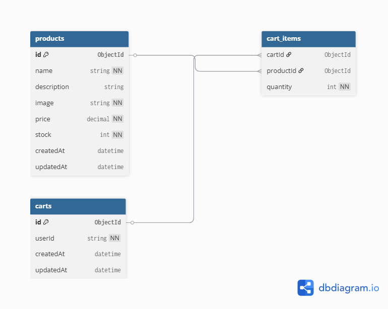

# 🛒 Final POS Backend Task

This is a NestJS-based backend system developed as part of the Backend Developer Interview Task for Final POS. It includes product and shopping cart management with validation, MongoDB integration, Swagger documentation, Docker support, and more.

---

## 📦 Features

- 🧾 CRUD operations for **Products**
- 🛍️ Full **Shopping Cart** lifecycle:
  - Create, update, delete cart
  - Add/remove products
  - Edit quantity
- ✅ Validation with `class-validator`
- 📚 API documentation with **Swagger**
- 🐳 Docker & Docker Compose ready
- 🌐 MongoDB integration with Mongoose
- 🧪 Unit test support (optional)

---

## 🗂️ Database Schema

This application uses MongoDB. Here's the data model relationship between collections:



---

## 🔗 API Documentation

Swagger is enabled for easy API testing and reference.

- Visit: [http://localhost:3000/api](http://localhost:3000/api)

Example endpoints include:

- `POST /products`
- `GET /products/:id`
- `POST /cart`
- `PATCH /cart/:id`
- `DELETE /cart/:id`

---

## 🚀 Getting Started

### 1. Clone the Repo

```bash
git clone https://github.com/mihirgosai/final-pos-backend-task.git
cd final-pos-backend-task
```

### 2. Install Dependencies

```bash
npm install
```

### 3. Start MongoDB (if not using Docker)

Make sure MongoDB is running locally at `mongodb://localhost:27017/final-pos`

### 4. Run the App

```bash
npm run start:dev
```

App will be available at: [http://localhost:3000](http://localhost:3000)

---

## 🐳 Docker Setup

To run the project with Docker:

### 1. Build and Start Containers

```bash
docker-compose up --build
```

### 2. Stop Containers

```bash
docker-compose down
```

This will spin up the backend and a MongoDB service automatically.

---

## 🧪 Running Tests (Optional)

```bash
npm run test
```

---
